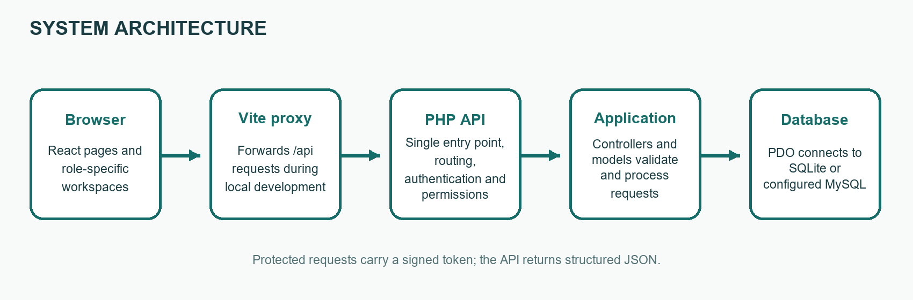
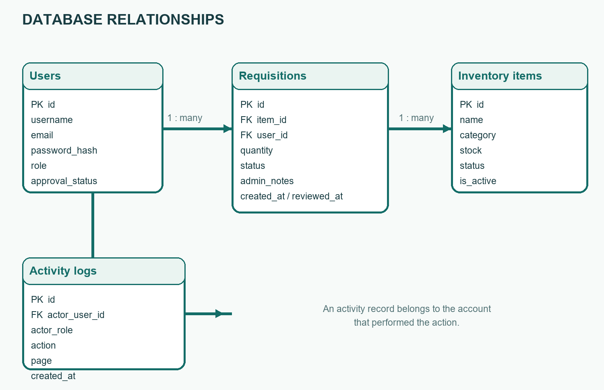
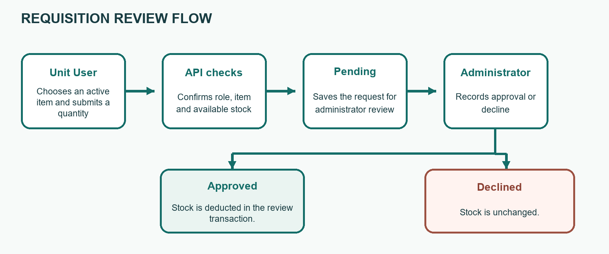

# Hospital Emergency Requisition Platform
## Project Documentation

**Project report**

A web-based platform for Emergency Unit supply requests, inventory coordination, account approval, and activity review.

**Prepared:** 9 October 2026

---

# Declaration and Certification

## Declaration

I prepared this report to describe the design, implementation, and testing of the Hospital Emergency Requisition Platform. The technical descriptions are based on the project source code, the API and frontend guides, and the integration checks carried out for this project. I have identified the supplied project report and assessment guide in the references where their structure or requirements informed this report.

This platform manages requests for supplies. It does not make clinical decisions or replace hospital procedures, professional judgement, or emergency communication.

**Name:** ______________________________________________

**Signature:** ___________________________________________

**Date:** _______________________________________________

## Certification

This section is reserved for the appropriate project supervisor or assessor to confirm review of the report.

**Supervisor / assessor:** _________________________________

**Signature:** ___________________________________________

**Date:** _______________________________________________

---

# Dedication, Acknowledgement and Abstract

## Dedication

I dedicate this work to healthcare teams who coordinate essential supplies while caring for patients.

## Acknowledgement

I am grateful to the people who provided the project brief and assessment guidance. I also acknowledge the sample project report and course guide listed in the references. Their structure helped me organise this document, while the system description and test results here are based on this project.

## Abstract

This project documents a web platform for managing Emergency Unit requests for medicines and non-drug supplies. It provides public information pages and protected workspaces for Unit Users, Store Personnel, and Hospital Administrators. Unit Users browse available inventory, submit requests, and follow their own request status. Store Personnel maintain the catalogue and inspect completed request decisions. Administrators approve accounts, assign roles, review requests, manage inventory, and inspect recorded activity and account request history.

The frontend is a React single-page application built with Vite and Tailwind CSS. The backend is an object-oriented PHP JSON API. It uses PDO with SQLite by default and can be configured for MySQL. Approved users authenticate with signed, expiring JSON Web Tokens. Database changes and API role checks enforce the main access rules. I tested PHP syntax, the production frontend build, key API workflows against an isolated SQLite database, and the public contact interface in a browser. The checks passed. The project provides a working foundation, but production use still requires verified hospital contacts, a private signing key, secure hosting, and operational review.

---

# Contents

1. Chapter One: Introduction
2. Chapter Two: Review of Concepts and Existing Approaches
3. Chapter Three: Methodology and System Design
4. Chapter Four: Implementation, Testing and Results
5. Chapter Five: Discussion, Conclusion and Recommendations
6. References
7. Appendix A: Running and Using the System
8. Appendix B: Data, API and Operating Notes

## List of figures

- Figure 3.1. Request and inventory system architecture.
- Figure 3.2. Main database relationships.
- Figure 3.3. Main requisition review flow.

## List of tables

- Table 3.1. User roles and functional requirements.
- Table 3.2. Main database records.
- Table 4.1. Integration and build test results.
- Table B.1. Main API endpoint summary.

I arranged the report using the project-report order recommended in the supplied assessment guide and the chapter layout shown in the supplied example report [1, 2].

---

# Chapter One: Introduction

## 1.1 Background

Emergency care depends on teams being able to identify supplies, request quantities, and coordinate the review of those requests. When the catalogue, requests, approvals, and stock counts are held in separate records, staff may need to repeat information or follow up across several channels. A shared request system can make those steps easier to see.

The Hospital Emergency Requisition Platform provides one digital workflow for the Emergency Unit and its supporting store and administration roles. It brings together an item catalogue, quantity-based requisitions, administrator decisions, and activity records. Its role-specific workspaces reflect the separate responsibilities of the people using it.

## 1.2 Problem statement

The project addresses the lack of a single, role-controlled place to browse Emergency supplies, request them, review requests, and maintain item stock. Without clear access rules and retained request history, it is harder to tell who requested an item, what decision was made, or whether an approved quantity was reflected in stock.

## 1.3 Aim and objectives

**Aim:** To design and implement a web platform that supports controlled Emergency Unit requisitions and related inventory administration.

The objectives are to:

- Provide public information pages and account registration and sign-in.
- Allow approved Unit Users to browse Drug and Non-Drug items and submit requests.
- Allow Store Personnel to maintain items and view reviewed request logs.
- Allow Administrators to manage user access, review requests, maintain inventory, and inspect account activity.
- Protect API operations with authentication, role checks, and parameterised database access.

## 1.4 Significance, scope and limits

The platform makes the request and decision trail easier to follow and separates duties between users. Its scope covers the Emergency Unit catalogue, requisitions, account approvals, store tools, administrator inventory management, and activity history.

It does not include electronic patient records, clinical decision support, procurement, billing, or automatic external messaging. The current contact actions open an application on the visitor's device; they do not deliver email or WhatsApp messages through the server.

---

# Chapter Two: Review of Concepts and Existing Approaches

## 2.1 Review approach

I used the supplied example project report as a guide to organising a background and review chapter, then used the supplied assessment guide to check which topics should appear in a complete project report [1, 2]. This chapter reviews the system concepts and design choices visible in this project. It does not claim to be a broad clinical or academic literature survey.

## 2.2 Requisition workflow

A requisition workflow connects an available item to a named requester, a quantity, a review decision, and a date. In this platform, a Unit User submits a request for the Emergency Unit. The request begins as Pending. An Administrator records Approved or Declined and may add notes. Approval decreases the available stock in the same database transaction as the decision. This makes the stock change and final status a single operation.

## 2.3 Role-based access and accountability

The system separates the Unit User, Store Personnel, and Hospital Administrator roles. The browser presents a different dashboard for each role, while the API independently checks the current account and its role before protected operations. Hiding a screen alone would not prevent a user from calling an API directly, so the backend checks permissions as well.

Activity records add a basic audit trail for account actions and dashboard page visits. Administrators can inspect recent activity or filter it to one account and see that account's requisition history.

## 2.4 Technology choices

- **React, React Router, Vite, and Tailwind CSS** provide the browser interface, page routes, development server, and responsive styling.
- **PHP classes** organise the JSON API, router, controllers, database access, authentication, and data models.
- **PDO and prepared statements** separate SQL instructions from values supplied by users. SQLite is the local default; the configuration also supports MySQL.
- **Signed JSON Web Tokens (JWTs)** carry an account identifier and expiry between the frontend and the API.

## 2.5 Existing approach and gap

A paper or disconnected process can record an item and decision, but it does not automatically provide this system's shared live catalogue, per-role views, stock update on approval, or filterable account history. The platform addresses that workflow gap.

The current system does not provide live push updates, external message delivery, multi-ward configuration, or automatic replenishment. These are possible future requirements rather than implemented features.

---

# Chapter Three: Methodology and System Design

## 3.1 Development method

I used an iterative build-and-check approach. I first inspected the existing frontend and PHP API, then compared the requested behaviour with the routes and data models already present. I added the missing administrator activity and inventory features, expanded the public pages, updated the database setup, and checked the result with syntax checks, a production build, isolated API tests, and a browser check.

This is an implementation-focused project. I did not conduct a survey, interview study, or clinical evaluation.

## 3.2 Functional requirements

| ID | Requirement | Main role |
|---|---|---|
| FR-01 | Register an account as a pending Unit User and sign in after approval. | All / Admin approves |
| FR-02 | Browse active Drug and Non-Drug inventory. | Unit / Store / Admin |
| FR-03 | Submit Emergency requisitions and view personal request history. | Unit User |
| FR-04 | Add and edit inventory items and inspect completed decisions. | Store Personnel |
| FR-05 | Approve or decline requests and add optional review notes. | Administrator |
| FR-06 | Approve or decline accounts and assign permitted roles. | Administrator |
| FR-07 | Add, edit, or remove active inventory items. | Administrator |
| FR-08 | Review activity and a selected account's requisition history. | Administrator |
| FR-09 | Record sign-ins, registrations, dashboard visits, and key changes. | System |

## 3.3 Non-functional requirements

- **Security:** Verify approved accounts and roles in the API; hash passwords; sign and expire tokens.
- **Data safety:** Use database constraints, prepared statements, and a transaction for approval and stock deduction.
- **Usability:** Provide clear public information, role-specific navigation, and responsive forms and lists.
- **Maintainability:** Keep routes, controllers, models, database configuration, and frontend pages in distinct files.

## 3.4 User requirements

A Unit User needs to find an item, request a quantity, and understand the result. Store Personnel need to update available items and check completed requests. An Administrator needs to review access and requests, maintain the catalogue, and see account history. All roles need feedback when an operation is not allowed or fails.

---

## 3.5 Architecture

| Layer | Responsibility |
|---|---|
| React browser app | Displays public pages and protected workspaces; sends JSON requests and bearer tokens. |
| Vite development proxy | Forwards local `/api` requests to the PHP service on port 8080. |
| PHP entry point and router | Handles CORS preflight, loads classes, matches HTTP method and path, and returns JSON. |
| Controllers and models | Check roles, validate inputs, perform workflow steps, and issue prepared database queries. |
| PDO database | Stores users, inventory items, requisitions, and activity logs in SQLite or configured MySQL. |

The browser sends JSON requests through the Vite proxy during development. The PHP API checks authentication and role access before working with stored data. Responses return to the browser as JSON.

## 3.6 Main data records

| Record | Important fields | Relationship and purpose |
|---|---|---|
| User | ID, username, email, password hash, role, approval status, created date | Owns requisitions and activity records; approval controls sign-in. |
| Inventory item | ID, name, category, stock, status, active flag, created date | Category is Drug or Non-Drug. Archived items leave the active catalogue. |
| Requisition | ID, item, user, quantity, unit, status, notes, created and reviewed dates | Connects one requester to one item; requesting unit is Emergency. |
| Activity log | ID, actor, role, action, page, related record, summary, timestamp | Records a signed-in user's key actions and dashboard visits. |

The user-to-requisition and item-to-requisition relationships are one-to-many. An activity record can belong to a user. If an account is later removed, its activity actor link may be cleared while the activity record remains.

---

---

## 3.7 Request flow

The Unit User checks an active item and stock, then submits a positive quantity. The API checks the role and available stock before storing a Pending request. An Administrator reviews the request. Approval deducts stock and stores Approved; a decline stores Declined without deducting stock. The Unit User and Store Personnel see the history allowed for their roles.

## 3.8 Privacy and ethics

The database stores account emails and operational supply records. Access is restricted by role. Passwords are stored as hashes. Staff should not enter patient-identifying information in request notes, activity summaries, or the public contact form. The system is a supply workflow, not a patient record or emergency clinical communication service.

---

# Chapter Four: Implementation, Testing and Results

## 4.1 Development environment and tools

The frontend uses React 18, React Router, Vite, and Tailwind CSS. The backend uses PHP 8 and PDO. SQLite is the default local database; MySQL can be selected in the API configuration. The API uses a small PHP router in `api/index.php` and loads classes from the library, controller, and model folders. No separate frontend component library or PHP framework is required.

## 4.2 Frontend modules

- The public layout contains Home, About, General Services, Policy, Contact, Sign in, and Register.
- Protected routes separate the Unit, Store, and Administrator dashboards. Dashboard navigation shows links for the signed-in role.
- The Unit catalogue and dashboard support browsing and request tracking.
- Store screens support stock management and reviewed request logs.
- Administrator screens support requisition decisions, registration review, inventory management, and activity and account history.
- The contact form prepares an email through the device's mail application. Separate links open phone, text, and WhatsApp actions.

## 4.3 Backend modules

- Authentication checks passwords, account approval, and JWT claims.
- Inventory endpoints list active items, allow Store Personnel and Administrators to add or edit, and allow only Administrators to remove items from the active catalogue.
- Requisition endpoints return results based on the caller's role and process submitted and reviewed requests.
- User endpoints allow Administrators to list users and update role and approval status.
- Activity endpoints record dashboard paths for authenticated users and return activity and account request history to Administrators.

## 4.4 Database and interface behaviour

On first use, SQLite tables and development seed accounts and inventory are created. Startup migrations add the activity log and active-item flag to an existing SQLite database without dropping its records. Removing an item archives it rather than deleting its row, preserving links from historical requisitions. Administrator approval and stock deduction use one transaction.

The public pages use a consistent teal and green palette and responsive layouts. Contact form submission opens the visitor's email application; it does not send or store a message on the API.

---

## 4.5 Test approach

I checked PHP syntax and built the frontend for production. I then used a fresh temporary SQLite database to exercise the API with development accounts. These integration checks did not use or reset the existing project database. I also opened the public Contact page in a browser and checked its contact routes and form fields.

---

## 4.6 Test results

| Test | Expected result | Observed result |
|---|---|---|
| PHP syntax checks | API PHP source files parse without syntax errors. | Pass |
| Vite production build | Frontend bundles successfully. | Pass |
| Unit and Store permissions | Unit cannot add inventory; Store cannot view admin activity. | Pass: HTTP 403 |
| Admin inventory actions | Admin can add and edit category, name, and stock. | Pass |
| Request review | Unit can submit; Admin approval updates request and stock. | Pass |
| Activity and account history | Page and request events are recorded; Admin can filter account history. | Pass |
| Store reviewed history | Store sees the approved request in completed logs. | Pass |
| Removal and history | Store cannot remove; Admin archive hides the item but preserves old requests. | Pass |
| Contact page | Browser shows call, email, SMS, WhatsApp, and message form options. | Pass |

## 4.7 Results and evaluation

The tested access boundaries match the intended roles for the exercised endpoints. Inventory archive preserved a request record and item name in history. Approval reduced stock and the request appeared in Store logs. The production bundle and PHP syntax checks completed successfully. The browser check confirmed that the contact controls and form fields were available.

The tests are focused integration and build checks, not a full automated test suite, load test, penetration test, or user acceptance study. The contact links use sample directory details and must not be treated as verified hospital contacts.

---

# Chapter Five: Discussion, Conclusion and Recommendations

## 5.1 Discussion of findings

The platform connects account approval, item availability, requisition submission, review, stock deduction, and activity history in one application. Separate browser workspaces make each role's normal tasks clearer, while API role checks protect data operations. Archiving rather than deleting inventory supports historical review. The focused tests show that these workflows operate together in the local configuration.

## 5.2 Objectives achieved

- Public information and account routes are present.
- Approved Unit Users can submit and follow their own Emergency requests.
- Store Personnel can maintain inventory and read reviewed request logs without access to Administrator functions.
- Administrators can review users and requisitions, manage inventory, and inspect activity and account request history.
- Password hashing, expiring signed tokens, role checks, prepared database access, and approval transactions are implemented.

## 5.3 Conclusion

I designed and implemented a working Emergency Unit requisition platform with role-specific interfaces and API-enforced responsibilities. In the tested local setup, the main account, inventory, request, review, and history workflows passed their integration checks. The system is a foundation for supply coordination and requires production configuration and hospital validation before operational use.

## 5.4 Recommendations

- Replace the development JWT secret and demo passwords; store secrets outside public source files.
- Verify real hospital phone numbers, email accounts, and WhatsApp routing before publishing the contact page.
- Deploy behind HTTPS with protected database and configuration files, reliable backups, and controlled administrator access.
- Add automated regression tests, security review, performance checks, accessibility review, and user acceptance testing.
- Consider server-side email, notification delivery, real-time updates, and configurable hospital units if approved as future scope.
- Define retention, recovery, and audit-review procedures with the hospital before storing operational records.

---

# References

[1] Manu Anthony. (2025). *Automated E-Learning System with SMS Alerts, Quiz Features, and Assignment Monitoring* [Project report]. Kumasi Technical University, Faculty of Applied Sciences and Technology, Computer Science Department. Supplied reference document: “SCOTT- COMBINED (1-5).docx”. Used as a guide to project-report organisation and chapter structure.

[2] Kumasi Technical University. (n.d.). *BCT 400 Project II: Project development format and assessment* [Course assessment guide]. Supplied reference document: “Project development format and assessment.pdf”. Used to organise the report chapters, requirements, design, implementation, testing, results, conclusion, references, and appendices.

[3] Hospital Emergency Requisition Platform. (2026). *Project source code, database schema, and API and frontend README files* [Software and project documentation].

## Reference note

I cite the supplied report and course assessment guide because they informed this document's format and required sections. The sample's subject is an e-learning system; its feature descriptions are not treated as features of this hospital requisition project. Statements about implemented software refer to this project's code and tests described in Chapter Four.

---

# Appendix A: Running and Using the System

## A.1 Local requirements

- Install PHP 8 or newer with PDO and the `pdo_sqlite` extension enabled.
- Install Node.js 18 or newer and npm.
- Allow the API to write to `api/storage` when SQLite is used.

## A.2 Start the application on Windows

1. Open a terminal in the project root and run `start-api.cmd`. The PHP development server listens at `http://127.0.0.1:8080`.
2. Open a second terminal in the project root and run `start-frontend.cmd`. Vite normally opens at `http://localhost:5173`.
3. Visit `GET http://127.0.0.1:8080/health` to confirm the API is available. Open the Vite address in a browser to view the frontend.
4. The first API request creates the SQLite database and development seed records when no database exists. Do not use demo credentials on a public deployment.

## A.3 Sample development accounts

| Role | Email | Development password |
|---|---|---|
| Hospital Administrator | `admin@hospital.local` | `Admin@12345` |
| Store Personnel | `store@hospital.local` | `Store@12345` |
| Emergency Unit User | `unit@hospital.local` | `Unit@12345` |

These values are for a local development database only. Change or remove them before deployment. A newly registered account is pending and cannot sign in until an Administrator approves it.

## A.4 Basic user steps

- **Unit User:** Sign in, open the catalogue, choose an active item and quantity, submit, and return to the dashboard to see status.
- **Store Personnel:** Sign in, add or update inventory, and open review logs to inspect completed Administrator decisions.
- **Administrator:** Review pending requisitions and registrations; use Inventory to maintain items; use Activity or a user's History link to inspect records.

---

# Appendix B: Data, API and Operating Notes

## B.1 Main API routes

| Method and route | Access | Purpose |
|---|---|---|
| `POST /auth/register` | Public | Create a pending Unit User account |
| `POST /auth/login` | Public | Sign in and receive a token |
| `GET /inventory` | Approved users | List active catalogue |
| `POST /requisitions` | Unit User | Submit an Emergency request |
| `GET /requisitions` | Approved users | Return records scoped to role |
| `PATCH /requisitions/{id}` | Admin | Approve or decline a pending request |
| `GET /users`; `PATCH /users/{id}` | Admin | List accounts and change approval or role |
| `POST /inventory`; `PUT /inventory/{id}` | Store or Admin | Add or edit an item |
| `DELETE /inventory/{id}` | Admin | Archive an item from active catalogue |
| `GET /activity?user_id={id}` | Admin | View activity and that account's requisitions |

## B.2 Important operating notes

- The Vite development proxy forwards `/api` routes to the PHP service and removes the `/api` prefix. Direct API calls use the path without `/api`.
- Add the exact frontend origin to `api/config.php` CORS settings when the frontend host or port changes.
- Set a long, random JWT secret and use HTTPS before deployment. Protect `config.php`, `schema.sql`, and the storage directory from direct public access.
- The public phone extensions and `.local` email addresses are sample values. The WhatsApp link prepares text but does not configure a verified hospital WhatsApp number.
- The contact message form opens the visitor's email application. It does not submit or store a message on the API.
- Do not enter patient names, patient numbers, or other sensitive clinical details in requisitions, activity records, or general contact messages.

## B.3 Current scope

The current system does not provide pharmacy procurement, supplier orders, automatic low-stock alerts, real-time push updates, server-side email delivery, patient records, or a multi-facility setup. These features require separate design, approval, and testing before they can be added.
